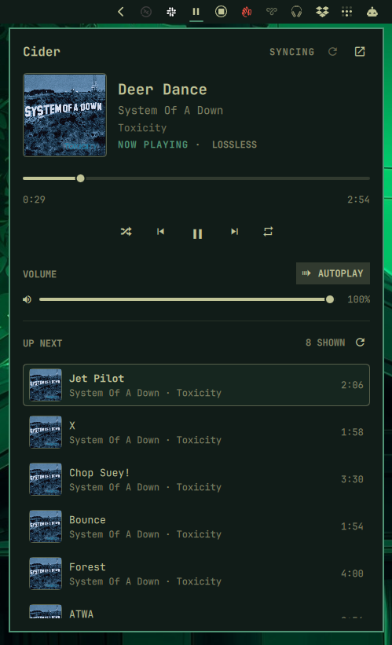

# Cider for the Omarchy bar

An Omarchy widget for controlling [Cider](https://cider.sh/) and Apple Music playback from the bar. It uses Cider's documented [localhost RPC API](https://github.com/ciderapp/docs/blob/main/docs/1.client/rpc.md) for transport controls, volume, seek, playback modes, and Up Next.



## What it does

- Shows album art, song, artist, album, playback state, and audio quality.
- Plays, pauses, skips forward, and goes back.
- Seeks within the current song.
- Sets Cider's own playback volume.
- Toggles shuffle, repeat, and autoplay.
- Shows the tracks after the current item in Cider's mixed history and queue response.
- Exposes playback and panel actions through `omarchy-shell zpl.cider ...`.

The Cider API also supports playing Apple Music URLs and catalog items, adding the current song to the library, rating, and queue edits. Those actions are intentionally outside the first widget release.

## Requirements

- Omarchy 4 with the Quickshell plugin system
- Cider with RPC enabled under `Settings > Connectivity > Manage External Application Access`
- An API token exported as `CIDER_API_KEY`
- Python 3.10 or newer

The current release is tested with Omarchy 4.0.1 and Cider 4.0.9.1.

## Install

From this checkout:

```bash
omarchy plugin add "file://$PWD" --enable
```

Or directly from GitHub:

```bash
omarchy plugin add https://github.com/zpl-zak/omarchy-cider-widget.git --enable
```

## First-time setup

In Cider, open `Settings > Connectivity > Manage External Application Access`, enable RPC, and generate an API token. Read it without putting the value in your shell history, then import it into the user service environment:

```bash
read -rsp 'Cider API token: ' CIDER_API_KEY
printf '\n'
export CIDER_API_KEY
~/.config/omarchy/plugins/zpl.cider/scripts/import-key
unset CIDER_API_KEY
```

If `CIDER_API_KEY` is already exported, only run the helper:

```bash
~/.config/omarchy/plugins/zpl.cider/scripts/import-key
```

The import lasts for the current login session. Repeat it after a new login unless your session setup already exports `CIDER_API_KEY`.

## Update

Git-managed installations update through Omarchy:

```bash
omarchy plugin update zpl.cider
```

## Remove

Remove the widget and clear its token from the user service environment:

```bash
omarchy plugin remove zpl.cider
systemctl --user unset-environment CIDER_API_KEY
omarchy restart shell
```

## Controls

On the bar:

- The widget stays icon-only; hover it to see the current song and artist.
- Left click opens the player panel.
- Middle click skips to the next song.
- Right click refreshes playback state.
- Mouse wheel moves backward or forward through tracks.

Inside the panel, use the buttons and sliders directly. Keyboard shortcuts are `P` for play or pause, `N` for next, `B` for previous, `S` for shuffle, `R` for repeat, `A` for autoplay, and `O` to open Cider.

The plugin settings expose the playback polling interval and the number of Up Next tracks. Playback defaults to a two-second refresh. The larger queue response is fetched only while the panel is open.

## IPC

```bash
omarchy-shell zpl.cider status
omarchy-shell zpl.cider playPause
omarchy-shell zpl.cider next
omarchy-shell zpl.cider previous
omarchy-shell zpl.cider volume 0.65
omarchy-shell zpl.cider seek 90
omarchy-shell zpl.cider open
```

## Troubleshooting

Check the RPC adapter without changing playback:

```bash
./cider-rpc.py status | jq
./cider-rpc.py queue 5 | jq
```

If the panel says the key is unavailable, import it into the user service environment. If it says RPC is unreachable, confirm Cider is running and its external application access setting is enabled.

## Privacy and security

- The Python helper sends `CIDER_API_KEY` only in Cider's `apptoken` header. It accepts HTTP loopback hosts only and disables proxy use for RPC requests.
- The token is read from the plugin process or the systemd user service environment. The plugin does not pass it as a command argument, print it, or write it to a file.
- Album art is loaded from URLs returned by Cider, normally Apple's image CDN. The API token is not attached to those image requests.
- The plugin has no install hook, does not use `sudo`, and does not contact an analytics service.

## Development

```bash
./tests/run
```

The test runner checks the JavaScript model, Python RPC adapter, QML service state, plugin manifest, shell scripts, QML syntax, and whitespace.

## License

MIT. Copyright 2026 Dominik Madarász. Portions of the interface were adapted from Omarchy's MIT-licensed media widget. See the [third-party notices](THIRD_PARTY_NOTICES.md).

This project is not affiliated with Cider Collective or Apple.
